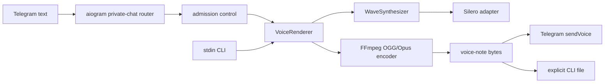

# Vslukh

<p align="center">
  
</p>

Vslukh is a small, local-first Telegram bot that turns regular and forwarded text
messages into Russian voice notes. Speech is generated on the host with Silero and
returned as an OGG/Opus Telegram voice note; the bot keeps no message or audio history.

The repository is deliberately narrow and operationally complete: Python 3.14, uv,
Ruff, strict mypy, pytest with branch coverage, pre-commit, a non-root container, and
SHA-pinned GitHub Actions. The accepted behavior is defined by
[SPEC-0004](specs/0004-configurable-silero-voices.md).

## What it does

- Speaks ordinary and forwarded private text messages with an operator-selected
  `kseniya`, `xenia`, or `baya` voice from one bundled Russian model.
- Replies with mono, 48 kHz OGG/Opus audio suitable for Telegram voice-note playback.
- Provides `tts-to-ogg` for testing the exact rendering path without Telegram.
- Runs speech generation locally and never writes Telegram messages or generated audio
  to persistent storage.
- Rejects overload immediately: two render pipelines globally and one per user by
  default, with no hidden queue.

Vslukh is an ordinary public BotFather bot. Disabling groups does not make direct
messages private or friends-only; anyone who discovers its username can send it text.
Application-level allowlists are intentionally outside v1.

## Requirements

Local development is supported on Linux x86-64 and requires:

- [Python 3.14](https://www.python.org/) on Linux x86-64 with AVX2
- [uv](https://docs.astral.sh/uv/)
- [FFmpeg](https://ffmpeg.org/) with the Opus encoder
- a bot token created with [BotFather](https://t.me/BotFather), for Telegram operation
  only

The production container includes Python, FFmpeg, application dependencies, and the
verified voice model. Docker operation requires an amd64 Linux host or compatible
emulation.

## Quick start

Clone the repository, create the locked development environment, and install the commit
hook:

```bash
uv sync --locked --all-groups
uv run pre-commit install
```

Provision the pinned `v5_5_ru` model into the ignored local model directory:

```bash
uv run python -m telegram_tts_bot.speech.model --output-dir .models/silero
```

Install FFmpeg with your operating-system package manager, then verify the renderer
without a Telegram token:

```bash
printf '%s' 'Привет! Это Вслух.' | uv run tts-to-ogg sample.ogg
ffprobe -v error sample.ogg
```

Copy the environment template and set the token in the ignored file:

```bash
cp .env.example .env
```

The application reads the process environment; it does not load `.env` automatically.
For a local shell session:

```bash
set -a
. ./.env
set +a
uv run python -m telegram_tts_bot
```

Do not paste the token into source files, Docker build arguments, command-line flags, CI
configuration, issues, or logs.

## BotFather setup

The complete Russian and English copy, ordered username candidates, avatar instructions,
and verification checklist are maintained in
[the BotFather launch pack](specs/BOTFATHER.md). In short:

1. Create the bot and store its token as a runtime secret.
2. Configure the localized name, About text, description, and `/start` and `/help`
   commands from the launch pack.
3. Upload [`assets/vslukh-avatar.png`](assets/vslukh-avatar.png).
4. Disable group joining, leave group privacy enabled, and leave inline mode disabled.
5. Verify direct text, forwarded text, unsupported media guidance, and both locales.

## Configuration

| Variable | Required | Default             | Meaning |
| --- | --- |---------------------| --- |
| `TELEGRAM_BOT_TOKEN` | Bot only | -                   | Secret token issued by BotFather. |
| `SILERO_MODEL_PATH` | No | Local or baked model | Path to the verified `v5_5_ru.pt`. |
| `TTS_VOICE` | No | `kseniya` p         | One of `kseniya`, `xenia`, or `baya`. |
| `TTS_MAX_CONCURRENCY` | No | `2`                 | Maximum active render pipelines process-wide. |
| `TTS_MAX_CONCURRENCY_PER_USER` | No | `1`                 | Maximum active pipelines for one Telegram user. |
| `LOG_LEVEL` | No | `INFO`              | Standard Python logging level. |

Both capacity values must be positive integers, and the per-user value cannot exceed the
global value. Configuration is validated once at startup and remains immutable.

The audition labels map to configuration as follows:

| Audition sample | `TTS_VOICE` |
| --- | --- |
| A | `kseniya` |
| B | `xenia` |
| F | `baya` |

All three speakers are included in the same model. Set one value in `.env` or the
process environment and restart the bot to change the process-wide voice:

```bash
TTS_VOICE=xenia
```

The model is Russian-first. Cyrillic text and ordinary punctuation are retained; Latin
letters are deterministically transliterated, digits are read individually, and
symbol-only input speaks sign names. This compatibility behavior is phonetic rather than
language-aware translation.

The bundled model is CC BY-NC-SA 4.0 and is limited to non-commercial use. A commercial
deployment requires separate permission from Silero; see
[Third-party notices](THIRD_PARTY_NOTICES.md).

## TTS command

`tts-to-ogg FILE [--force]` reads strict UTF-8 text from standard input and writes the
same OGG/Opus format used by the bot:

```bash
printf '%s' 'Текст для проверки' | uv run tts-to-ogg output.ogg
```

The command:

- accepts text only through stdin, keeping it out of the process list;
- rejects empty input but intentionally has no Telegram-length limit;
- refuses to overwrite a file unless `--force` is supplied;
- requires the destination parent directory to exist;
- renders fully before touching the destination and replaces atomically with `--force`;
- prints only the resolved output path on success and never logs the supplied text.

Exit status is `0` for success, `2` for usage/input/path errors, `1` for model, FFmpeg,
synthesis, or write failures, and `130` for interruption.

## Architecture



Telegram handlers and the CLI depend on `VoiceRenderer`, not Silero or FFmpeg. Silero is
the sole production `WaveSynthesizer`; replacing the engine means adding one adapter and
changing composition, not editing message handlers. The bot loads one model and one
configured speaker per process and runs blocking synthesis and encoding in a dedicated
executor.

No runtime component downloads a model, opens a database, creates a cache, or stores
input. Telegram still necessarily receives messages and returned voice notes as part of
its service; "local-first" describes speech generation and this application's storage
behavior, not Telegram's own retention.

## Docker

Build the final amd64 image:

```bash
docker build --platform linux/amd64 --target runtime -t vslukh:local .
```

Run it with the ignored environment file:

```bash
docker run --rm --init --env-file .env vslukh:local
```

The image runs as an unprivileged user, contains the model at `/opt/silero/v5_5_ru.pt`,
and needs no volume. Stop the container with `SIGTERM`; the bot stops intake and drains
active worker jobs before exiting. Exactly one polling replica may use a token at a
time.

Test the baked renderer without starting Telegram:

```bash
container_id=$(docker create --interactive --entrypoint tts-to-ogg vslukh:local /tmp/sample.ogg)
printf '%s' 'Проверка контейнера' | docker start --attach --interactive "$container_id"
docker cp "$container_id:/tmp/sample.ogg" ./container-sample.ogg
docker rm "$container_id"
```

## Development

Run the same checks used by CI:

```bash
uv run --locked ruff check .
uv run --locked ruff format --check .
uv run --locked mypy src tests
uv run --locked pytest
uv build
```

Pre-commit may apply Ruff fixes or formatting. Review those changes, stage them yourself,
and rerun the commit; the hook never stages files. Fast tests use fakes and do not need a
model. Real-model and constrained stress tests are explicitly marked and run in their
documented container jobs.

Behavioral work is specification-first. Read [the specification index](specs/README.md)
and [CONTRIBUTING.md](CONTRIBUTING.md) before changing bot behavior, public commands,
models, capacity, privacy, deployment, or BotFather metadata.

## CI and releases

Every push and pull request runs independent lint/build, unit-test, and real
model/container jobs. A semver tag matching the project version, such as `v0.1.0`, also
runs a two-render test inside a two-CPU, 1 GiB container before publishing.

Successful tags publish a non-root linux/amd64 image to GHCR with exact semver, commit
SHA, and `latest` tags, then create a GitHub release containing the Python artifacts and
an SPDX JSON SBOM. The image receives build-provenance and SBOM attestations. Releases do
not deploy to a host.

## Troubleshooting

### `ffmpeg` is missing

Install FFmpeg and confirm both commands are available:

```bash
ffmpeg -version
ffprobe -version
```

### Model verification fails

Delete only the ignored `.models/silero` directory and rerun the explicit provisioning
helper. Never substitute an unverified file under the accepted model filename. The
canonical source and SHA-256 value live in SPEC-0004.

### Telegram reports a polling conflict

Another process is polling with the same token. Stop the other local/container instance;
Vslukh intentionally supports exactly one replica.

### The bot says it is busy

There is no waiting queue. Let the active render finish and retry. Raise capacity only
after validating memory use on the deployment host.

### A forwarded post is not spoken

Only Telegram's `Message.text` is accepted. A photo, video, or document caption remains
unsupported even when forwarded.

## License and security

Vslukh is licensed under
[GNU GPL-3.0-or-later](LICENSE). Bundled and containerized third-party components are
described in [THIRD_PARTY_NOTICES.md](THIRD_PARTY_NOTICES.md). Please report security
issues through the private process in [SECURITY.md](SECURITY.md).

The application license does not replace the separately bundled Silero model's
CC BY-NC-SA 4.0 terms. The model is for non-commercial use unless separate permission
has been obtained from Silero.
