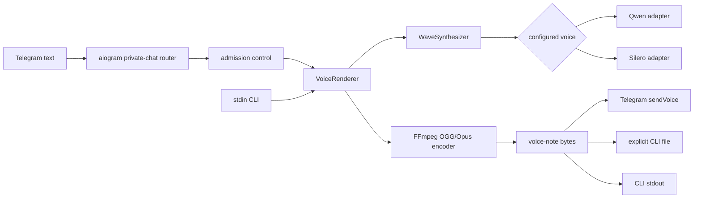

# Vslukh

<p align="center">
  
</p>

Vslukh is a small, local-first Telegram bot that turns regular and forwarded text into
voice notes. Speech is generated on the host with Qwen3-TTS or Silero and returned as an
OGG/Opus Telegram voice note; the bot keeps no message or audio history.

The repository is deliberately narrow and operationally complete: Python 3.14, uv,
Ruff, strict mypy, pytest with branch coverage, pre-commit, a non-root container, and
SHA-pinned GitHub Actions. The accepted behavior is defined by
[SPEC-0008](specs/0008-faster-qwen-runtime.md).

## What it does

- Speaks ordinary and forwarded private text messages with startup-selected `aiden`,
  `serena`, `kseniya`, `xenia`, or `baya`.
- Uses Qwen Aiden by default for mixed Russian-English text; Serena uses the same local
  model, while the three Silero voices remain lightweight Russian-first alternatives.
- Replies with mono, 48 kHz OGG/Opus audio suitable for Telegram voice-note playback.
- Provides `tts-to-ogg` for testing the exact rendering path without Telegram.
- Runs speech generation locally and never writes Telegram messages or generated audio
  to persistent storage.
- Rejects overload immediately: one render pipeline globally and per user by default,
  with no hidden queue.

Vslukh is an ordinary public BotFather bot. Disabling groups does not make direct
messages private or friends-only; anyone who discovers its username can send it text.
Application-level allowlists are intentionally outside v1.

## Requirements

Local development is supported on Linux x86-64 and requires:

- [Python 3.14](https://www.python.org/) on Linux x86-64 with AVX2
- [uv](https://docs.astral.sh/uv/)
- [FFmpeg](https://ffmpeg.org/) with the Opus encoder
- [SoX](https://sourceforge.net/projects/sox/) for the Qwen audio stack
- a bot token created with [BotFather](https://t.me/BotFather), for Telegram operation
  only

Qwen requires an NVIDIA GPU with BF16 support. The verified baseline is 8 GiB VRAM,
at least 8 GiB host RAM, and one concurrent render. Silero can run on CPU; its measured
two-render baseline remains two CPUs and 1 GiB RAM. The production image is amd64 and
contains the CUDA runtime and Silero model, but Qwen's roughly 2.5 GB snapshot is mounted
separately rather than baked into the image. The validated runtime image is about 6.22 GB
uncompressed. GPU containers also require the NVIDIA Container Toolkit on the host.

## Quick start

Clone the repository, create the locked development environment, and install the commit
hook:

```bash
uv sync --locked --all-groups
uv run pre-commit install
```

When upgrading an existing checkout from the former `qwen-tts` distribution, repair
their shared `qwen_tts` import after the first sync:

```bash
uv sync --locked --all-groups --reinstall-package qwen-tts-hf
```

Fresh environments need only the ordinary sync command above.

Provision the exact pinned Qwen snapshot into the ignored local model directory. This
downloads roughly 2.5 GB once, shows per-file progress with KiB/MiB/GiB units on stderr,
and verifies every file before installing it:

```bash
uv run python -m telegram_tts_bot.speech.qwen_model
```

Press Ctrl+C once to cancel provisioning. The command closes the active download,
removes partial staging data, prints a concise cancellation message, and exits 130.

For a CPU-only Silero configuration, provision its pinned `v5_5_ru` model instead:

```bash
uv run python -m telegram_tts_bot.speech.model --output-dir .models/silero
```

Install FFmpeg and SoX with your operating-system package manager, then verify the
default Qwen renderer on a CUDA host without a Telegram token:

```bash
printf '%s' 'Привет! Это Вслух.' | ./bin/tts sample.ogg
ffprobe -v error sample.ogg
```

Copy the environment template and set the token in the ignored file:

```bash
cp .env.example .env
```

The bot and TTS command automatically load this repository's `.env` without replacing
variables already exported by the shell. The launchers locate the repository from their
own path, so they remain valid when called from another working directory. From the
repository root, start the bot with:

```bash
./bin/run_bot
```

Do not paste the token into source files, Docker build arguments, command-line flags, CI
configuration, issues, or logs.

## BotFather setup

The complete Russian and English copy, ordered username candidates, avatar instructions,
and verification checklist are maintained in
[the BotFather launch pack](specs/BOTFATHER.md). In short:

1. Create the bot and store its token as a runtime secret.
2. Configure the localized name, About text, description, and `/start` and `/help`
   commands from the launch pack.
3. Upload [`assets/vslukh-avatar.png`](assets/vslukh-avatar.png).
4. Disable group joining, leave group privacy enabled, and leave inline mode disabled.
5. Verify direct text, forwarded text, unsupported media guidance, and both locales.

## Configuration

| Variable | Required | Default | Meaning |
| --- | --- | --- | --- |
| `TELEGRAM_BOT_TOKEN` | Bot only | - | Secret token issued by BotFather. |
| `QWEN_MODEL_PATH` | For Qwen | Local or mounted model | Path to the verified Qwen snapshot directory. |
| `SILERO_MODEL_PATH` | For Silero | Local or baked model | Path to the verified `v5_5_ru.pt`. |
| `TTS_VOICE` | No | `aiden` | One of `aiden`, `serena`, `kseniya`, `xenia`, or `baya`. |
| `TTS_MAX_CONCURRENCY` | No | `1` | Maximum active render pipelines process-wide. Qwen requires exactly `1`. |
| `TTS_MAX_CONCURRENCY_PER_USER` | No | `1` | Maximum active pipelines for one Telegram user. |
| `LOG_LEVEL` | No | `INFO` | Standard Python logging level. |

Both capacity values must be positive integers, and the per-user value cannot exceed the
global value. Configuration is validated once at startup and remains immutable.

Set one value in `.env` or the process environment and restart the bot to change the
process-wide voice:

```bash
TTS_VOICE=serena
```

Qwen Aiden and Serena receive the original text with automatic language selection and
are intended for mixed Russian-English messages. The shared snapshot is loaded once on
`cuda:0`; inference is serialized. Silero is Russian-first: Cyrillic and punctuation are
retained, while Latin letters are deterministically transliterated and digits are read
individually.

The exact mixed-language prompt and all 12 historical Piper, Silero, and Qwen audition
WAVs are in [the chronological audition archive](auditions/README.md). Qwen code and
weights are Apache-2.0, and the accelerated CUDA-graph runtime is MIT. The bundled
Silero model is CC BY-NC-SA 4.0 and limited to NonCommercial use; see
[Third-party notices](THIRD_PARTY_NOTICES.md).

## TTS command

`tts-to-ogg [--voice VOICE] [FILE] [--force]` reads strict UTF-8 text from standard
input and produces the same OGG/Opus format used by the bot. The repository launcher
automatically selects the locked environment and repository `.env`:

```bash
printf '%s' 'Текст для проверки' | ./bin/tts --voice aiden output.ogg
printf '%s' 'Текст для проверки' | ./bin/tts --voice aiden | paplay
```

The command:

- accepts text only through stdin, keeping it out of the process list;
- selects `--voice` first, then `TTS_VOICE`, then the default `aiden`;
- rejects empty input but intentionally has no Telegram-length limit;
- writes complete OGG bytes to stdout when `FILE` is omitted;
- refuses to overwrite a file unless `--force` is supplied and rejects `--force`
  without `FILE`;
- requires the destination parent directory to exist;
- renders fully before touching the destination and replaces atomically with `--force`;
- prints model-load and per-chunk Qwen progress on stderr without logging supplied text;
- reports synthesis plus encoding time on stderr, excluding model initialization;
- prints only the resolved output path on stdout after successful file output.

Qwen processes long input sequentially in chunks of at most 500 Unicode characters.
Before chunking, it replaces Telegram-style em dashes (`—`) with ASCII minus characters
so the punctuation produces the intended break. Silero text processing is unchanged.
The CUDA-graph runtime performs a one-time warmup during model loading, then reports each
chunk on stderr so a long render does not look stalled. On the reference RTX 2000 Ada
8 GiB GPU, the exact 1,304-character, three-chunk test took 50.79 seconds with 3.40 GiB
peak reserved VRAM. The former official sequential runtime took 100.47 seconds with
3.45 GiB. The accelerated output is deterministic for the fixed seed but differs from
the former runtime, so both versions are retained in the audition archive.

The runtime uses PyTorch SDPA and manual CUDA graph capture. FlashAttention, chunk
batching, partial streaming, and parallel generation are not part of the supported
production path.

Exit status is `0` for success, `2` for usage/input/path errors, `1` for model, FFmpeg,
synthesis, or write failures, and `130` for interruption.

## Architecture



Telegram handlers and the CLI depend on `VoiceRenderer`, not Qwen, Silero, or FFmpeg.
The composition root selects one `WaveSynthesizer` from `TTS_VOICE`. The bot loads one
model and configured speaker per process and runs blocking synthesis and encoding in a
dedicated executor.

No runtime component downloads a model, opens a database, creates a cache, or stores
input. Telegram still necessarily receives messages and returned voice notes as part of
its service; "local-first" describes speech generation and this application's storage
behavior, not Telegram's own retention.

## Docker

For a persistent server installation, including CPU-only and NVIDIA GPU procedures,
secret handling, automatic restarts, verification, and upgrades, see
[the deployment guide](DEPLOYMENT.md).

Build the final amd64 image:

```bash
docker build --platform linux/amd64 --target runtime -t vslukh:local .
```

Run the default Qwen voice with the ignored environment file, a read-only verified model
mount, and one NVIDIA GPU:

```bash
docker run --rm --init --gpus device=0 --env-file .env \
  --mount type=bind,source=/absolute/path/to/.models/qwen3-tts-12hz-0.6b-customvoice,target=/models/qwen3-tts-12hz-0.6b-customvoice,readonly \
  vslukh:local
```

The image runs as an unprivileged user, verifies the mounted Qwen snapshot before load,
and contains the Silero fallback at `/opt/silero/v5_5_ru.pt`. A CPU-only Silero run sets
`TTS_VOICE=kseniya` and may set `TTS_MAX_CONCURRENCY=2`; it does not need the Qwen mount
or a GPU. Stop with `SIGTERM`; the bot drains active work before exiting. Exactly one
polling replica may use a token at a time.

Test the baked renderer without starting Telegram:

```bash
container_id=$(docker create --interactive --env TTS_VOICE=kseniya \
  --env TTS_MAX_CONCURRENCY=2 --entrypoint tts-to-ogg vslukh:local /tmp/sample.ogg)
printf '%s' 'Проверка контейнера' | docker start --attach --interactive "$container_id"
docker cp "$container_id:/tmp/sample.ogg" ./container-sample.ogg
docker rm "$container_id"
```

## Development

Run the same checks used by CI:

```bash
uv run --locked ruff check .
uv run --locked ruff format --check .
uv run --locked mypy src tests
uv run --locked pytest
uv build
```

Pre-commit may apply Ruff fixes or formatting. Review those changes, stage them yourself,
and rerun the commit; the hook never stages files. Fast tests use fakes and do not need a
model. Real-model and constrained stress tests are explicitly marked and run in their
documented container jobs.

Behavioral work is specification-first. Read [the specification index](specs/README.md)
and [CONTRIBUTING.md](CONTRIBUTING.md) before changing bot behavior, public commands,
models, capacity, privacy, deployment, or BotFather metadata.

## CI and releases

Every push and pull request runs independent lint/build, unit-test, and real
model/container jobs. A semver tag matching the project version, such as `v0.1.0`, also
runs the retained Silero two-render test inside a two-CPU, 1 GiB container before
publishing. Qwen's CUDA integration is exercised manually on a GPU host.

Successful tags publish a non-root linux/amd64 image to GHCR with exact semver, commit
SHA, and `latest` tags, then create a GitHub release containing the Python artifacts and
an SPDX JSON SBOM. The image receives build-provenance and SBOM attestations. Releases do
not deploy to a host.

## Troubleshooting

### `ffmpeg` is missing

Install FFmpeg and confirm both commands are available:

```bash
ffmpeg -version
ffprobe -version
```

### Model verification fails

Delete only the affected ignored model directory and rerun its explicit provisioning
helper. Never substitute an unverified file or add an unlisted file to the Qwen
snapshot. Canonical sources and hashes live in SPEC-0008 and its superseded SPEC-0005
model-selection contract.

### Telegram reports a polling conflict

Another process is polling with the same token. Stop the other local/container instance;
Vslukh intentionally supports exactly one replica.

### The bot says it is busy

There is no waiting queue. Let the active render finish and retry. Raise capacity only
after validating memory use on the deployment host.

### A forwarded post is not spoken

Only Telegram's `Message.text` is accepted. A photo, video, or document caption remains
unsupported even when forwarded.

## License and security

Vslukh is licensed under
[GNU GPL-3.0-or-later](LICENSE). Bundled and containerized third-party components are
described in [THIRD_PARTY_NOTICES.md](THIRD_PARTY_NOTICES.md). Please report security
issues through the private process in [SECURITY.md](SECURITY.md).

The application license does not replace third-party terms. Qwen code and weights are
Apache-2.0. The separately bundled Silero model remains CC BY-NC-SA 4.0 and is for
NonCommercial use unless separate permission has been obtained from Silero.
